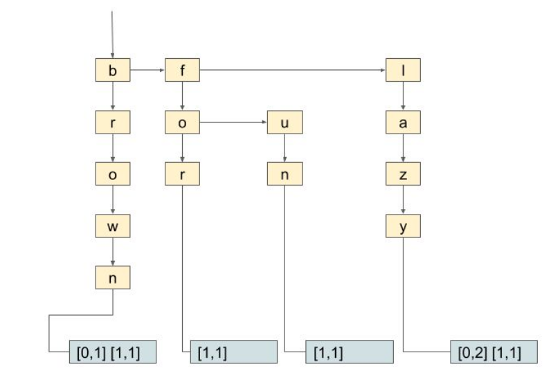

# MiniSearch
<p align="center">
  
</p>
<br />Implementation of a mini search engine mechanism using a Trie inverted index. The application opens a docfile given, which contains articles with an id in each line and fetches them in memory, mapping it's id with content. Then inserts every word of each article into the Trie keeping the id number. Then the application can execute different search queries about the articles. Valid queries are explained later. 

## Deployment

The code was developed and tested on **Linux Ubuntu 16.04 LTS** using **gcc v5.4.0**.

## Prerequisites

A Linux distribution is required with a gcc compiler order to compile and execute. _gcc v5.4.0_ or older is recommended.
<br />You can check your gcc compiler version using:
<br />``` $ gcc --version ```

You can install the latest gcc compiler on Ubuntu based systems using:
<br />``` $ sudo apt install build-essential ``` 

## Getting Started
Download Repository Locally using:
<br /> ```$ git clone https://github.com/AndCharalampous/minisearch.git ```

## Compilation
Compile code guiding in src directory and using the Makefile:
<br /> ```$ cd src```
<br /> ```$ make```
<br /> Executable file minisearch is created.

### Execution
Execute using:
<br /> ```$ ./minisearch -k K -i docfile```
* K: Number of results for each query
* docfile: Name of file containing articles

### Queries
* /search: word1 word2
<br />Searchs in index and finds for each given word, the article where the word is reffered. Computes the score of relatively between word and article, using the formula [BM25](https://en.wikipedia.org/wiki/Okapi_BM25). Then prints the K articles with the highest scores, showing also in which line is the word is referred.
* /df [word]
<br />If df is given with a word, it prints the number of articles that contain the word. If no word given, it prints the every word in Index with the number of articles containing the word.
* /tf id word
<br />Prints the number of occurences of the word in the article with the given id.
* /exit
<br />Exits application.

## Author

**Andreas Charalampous** - https://github.com/AndCharalampous

## License

This project is licensed under the MIT License - see the [LICENSE.md](LICENSE.md) file for details
